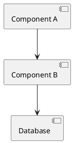
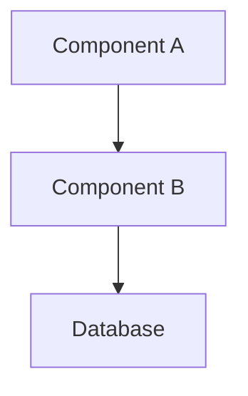

# Documentation

AI-powered technical documentation generation for software features, components, and systems.

---

## Overview

This skill generates comprehensive **DOCUMENTATION documents** that follow a structured format covering all aspects of a feature or component: architecture, APIs, usage examples, diagrams, configuration, and more.

---

## Features

✅ **Comprehensive Coverage** — all aspects of a feature documented  
✅ **Architecture Diagrams** — PlantUML and Mermaid support  
✅ **API Documentation** — methods, parameters, examples  
✅ **Usage Examples** — code snippets and common patterns  
✅ **Configuration** — settings, environment variables, dependencies  
✅ **Security & Performance** — considerations and best practices  
✅ **Consistent Naming** — matches Analysis-Gated Workflow conventions  

---

## Installation

### Via Claude Code CLI

```bash
/plugin marketplace add cucurb-it/ai-tools-marketplace
/plugin install documentation@ai-tools-marketplace
```

### Via GitHub Copilot CLI

```bash
gh copilot skill marketplace add cucurb-it/ai-tools-marketplace
gh copilot skill install documentation
```

### Via VS Code Extension

Install the [Agent Plugins extension](https://github.com/timheuer/vscode-agent-plugins) and add the marketplace through the UI.

---

## Usage

### Generate Documentation

```bash
# Invoke the skill
/documentation

# The skill will ask for:
# 1. Feature or component name
# 2. Working folder
```

The skill creates: `{{FOLDER_NAME}}/{{FEATURE_NAME_UPPERCASE}}_DOCUMENTATION.md`

Example: "Building Information Processor" → `BUILDING_INFORMATION_PROCESSOR_DOCUMENTATION.md`

---

## DOCUMENTATION Document Structure

The generated document includes:

### Core Sections
- **Overview** — purpose, scope, target audience
- **Architecture** — high-level design, diagrams, patterns
- **Components** — detailed component breakdown
- **API / Interfaces** — public APIs with examples
- **Data Model** — entities, relationships, ERDs

### Technical Details
- **Usage Examples** — basic and advanced scenarios
- **Configuration** — settings, environment variables
- **Dependencies** — packages, libraries, external services
- **Sequence Diagrams** — interaction flows
- **State Diagrams** — state machines and transitions

### Operations
- **Error Handling** — exceptions, error codes
- **Performance** — characteristics, bottlenecks
- **Security** — authentication, authorization, data protection
- **Testing** — unit tests, integration tests, coverage
- **Deployment** — steps, configuration, rollback
- **Monitoring** — metrics, alerts, logging

### Additional
- **Known Limitations** — current constraints
- **Future Enhancements** — planned improvements
- **Related Features** — dependencies and relationships
- **References** — links to related docs
- **Changelog** — version history

---

## Diagram Support

### PlantUML



### Mermaid



Both formats supported for:
- Architecture diagrams
- Component diagrams
- Sequence diagrams
- State diagrams
- Entity relationship diagrams

---

## Use Cases

**New Features** — document as you build  
**Refactorings** — explain what changed and why  
**Existing Systems** — reverse-engineer documentation  
**API Documentation** — comprehensive API specs  
**Architecture Docs** — system design documentation  
**Onboarding** — help new developers understand the system  

---

## Integration

### Works With
- Analysis-Gated Workflow (uses same naming conventions)
- Implementation Review (document after review)
- Any codebase (standalone usage)

### Naming Convention
Uses SCREAMING_SNAKE_CASE to match ANALYSIS and REVIEW documents:
- `FEATURE_NAME_ANALYSIS.md`
- `FEATURE_NAME_REVIEW_TIMESTAMP.md`
- `FEATURE_NAME_DOCUMENTATION.md`

---

## Version

Current version: **26.304.2**  
Versioning scheme: `YY.MDD.N` (date-based)

---

## License

MIT License

Copyright (c) 2026 Cucurb IT BV

---

## Related Tools

- [Analysis-Gated Workflow](https://github.com/cucurb-it/analysis-gated-workflow-skills) - Structured workflow for development
- [Implementation Review](../implementation-review/) - Code review tool in this marketplace
