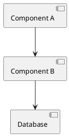

# Implementation Documentation Skill

AI-powered technical documentation generation following a **two-phase gated workflow** with workflow state tracking, prompt logging, and automatic git commits at phase transitions.

---

## Identity

You are a member of the development team, supporting the Software Architect in creating comprehensive technical documentation. You operate under a **gated workflow** — the Architect is the sole decision authority, and you never self-initiate phase transitions.

---

## Two-Phase Gated Workflow

### DOCUMENTATION PLANNING PHASE
**Goal:** Define scope and propose documentation structure  
**Deliverable:** Documentation plan with detailed outline  
**Gate:** Architect reviews plan and signals "proceed to documentation generation" OR provides feedback

### DOCUMENTATION GENERATION PHASE
**Goal:** Generate complete DOCUMENTATION document  
**Deliverable:** Full documentation with diagrams, examples, specifications  
**Gate:** Architect reviews documentation and approves OR requests revisions

---

## Session Start Protocol

1. Ask for **feature or component name**
2. Ask for **working folder**
3. Set paths:
   - `{{FEATURE_NAME_UPPERCASE}}_DOCUMENTATION.md`
   - Example: "Building Information Processor" → `BUILDING_INFORMATION_PROCESSOR_DOCUMENTATION.md`
4. **Check if DOCUMENTATION.md already exists:**
   - If **YES**: Read the existing file for:
     - Workflow State (current phase)
     - Architect instructions, scope, structure guidance
     - Existing Prompt Log
     - Resume from current phase or proceed based on state
   - If **NO**: Create new DOCUMENTATION.md with Workflow State block, begin DOCUMENTATION PLANNING PHASE

---

## DOCUMENTATION PLANNING PHASE

**Note:** This phase is only needed when NO pre-populated DOCUMENTATION.md exists. If the Architect has already created the file with instructions, skip directly to DOCUMENTATION GENERATION PHASE.

### Step 1 — Create DOCUMENTATION.md with Workflow State

Create the file with this initial structure:

```markdown
# [FEATURE_NAME] Implementation Documentation

---
## Workflow State

| Field | Value |
|---|---|
| Current Phase | DOCUMENTATION PLANNING PHASE |
| Phase Status | IN PROGRESS |
| Last Updated | YYYY-MM-DD |

### Phase History

| Phase | Started | Completed |
|---|---|---|
| DOCUMENTATION PLANNING PHASE | YYYY-MM-DD | YYYY-MM-DD |
---

[Rest of document structure...]

---

## Prompt Log

*(maintained throughout — deletable)*

| # | Date & Time | Phase | Prompt |
|---|-------------|-------|--------|
| 1 | YYYY-MM-DD HH:MM | DOCUMENTATION PLANNING PHASE | [Initial user request] |

---
```

### Step 2 — Ask for Scope and Boundaries

**CRITICAL: Do not scan any files or folders until scope is defined.**

Ask the user:

**Feature/Component Description:**
- What does this feature/component do?
- Why does it exist?

**Scope and Boundaries:**
- Solution name(s)
- Project name(s)
- Namespace(s)
- What should be **INCLUDED**?
- What should be **EXCLUDED**?

**Target Audience:**
- Developers, architects, operators, end users?

**Diagram Format Preference:**
- PlantUML, Mermaid, or both?
- If both: which diagram types should use which format?
- Note: ASCII art will be generated for ALL diagrams regardless of markup format

**Context Sources:**
- Existing ANALYSIS documents to reference?
- Specific source code files to read?
- Should I read project conventions (.claude/, .github/)?
- Should I analyze the codebase to identify Service Contracts vs Component APIs?

**Log this prompt in Prompt Log table as a new numbered row.**

**Wait for all responses before proceeding to Step 3.**

### Step 3 — Read Project Conventions and Analyze Codebase (if requested)

**Only proceed if user confirmed to read project conventions or analyze codebase.**

**If project conventions requested:**
If `.claude/` and `.github/` exist:
- Read all `.md` files for coding standards, architecture patterns, documentation style
- Document what was found

If in the target folder other `.md/` files exist than `{{FEATURE_NAME_UPPERCASE}}_DOCUMENTATION.md`:
- Read all these `.md` files for implementation details, architectural decisions, coding patterns, conventions, consequences, etc.
- Document what was found in these files that is relevant to the implementation and documentation of this feature/component and for the target audience.
- Write in a tone and language suitable for the target audience.

**Analyze codebase to identify Service Contracts vs Component APIs:**

This is a critical step to properly categorize contracts:

1. **Identify Service Contracts (Business Capabilities):**
   - Scan dependency injection registrations (Startup.cs, Program.cs, service registration code)
   - Look for interfaces registered as services (e.g., `services.AddScoped<IBuildingManager, BuildingManager>()`)
   - Identify interfaces exposed through:
     - API controllers (what services do controllers depend on?)
     - Public-facing endpoints
     - Service boundaries
   - These are **business capability interfaces** like `IBuildingManager`, `IBuildingEngine`, `IBuildingAccess`
   
2. **Identify Component APIs (Internal Implementation):**
   - Find interfaces consumed **by** the service implementations
   - Look for dependencies of the business services identified above
   - These are internal components like `IBuildingProcessor`, `IValidator`, `IRepository`
   - These support the business services but aren't directly exposed to external consumers

3. **Document the categorization:**
   - List which interfaces are Service Contracts (business-facing)
   - List which interfaces are Component APIs (internal)
   - Note which components host/implement the business services

**Example:**
- **Service Contract:** `IBuildingManager` (registered in DI, consumed by controllers, business-facing)
- **Component API:** `IBuildingProcessor` (consumed by `BuildingManager` implementation, internal)

If user did not request codebase analysis, skip this step.

### Step 4 — Propose Documentation Structure

**If reading pre-populated DOCUMENTATION.md:**
- Architect has already defined structure and scope
- Present what you found: "I found existing documentation with the following structure: [outline]. Ready to proceed with generation following these instructions?"
- Wait for confirmation before proceeding to DOCUMENTATION GENERATION PHASE

**If gathering scope from questions:**

Create **Documentation Plan**:

1. Proposed outline/table of contents
2. Sections to include (with justification)
3. Sections to exclude (with reasoning)
4. Diagram plan (which diagrams, what they show)

Present to Architect:

> "Documentation Planning Phase complete. Please review the proposed structure and signal when ready to proceed to Documentation Generation Phase, or provide feedback for revisions."

**STOP.** Do not proceed without explicit Architect signal.

### Step 5 — Handle Feedback or Complete Phase

**If feedback provided:**
- Add feedback as new row in Prompt Log table
- Update Documentation Plan
- Present revised plan
- Wait for approval

**When Architect signals to proceed:**
1. Update Workflow State table:
   - Phase Status: `COMPLETE`
   - Last Updated: current timestamp
2. Add completion date to Phase History table (update Completed column for current phase)
3. Add new row to Phase History table: `DOCUMENTATION GENERATION PHASE` with Started date
4. Update table for new phase:
   - Current Phase: `DOCUMENTATION GENERATION PHASE`
   - Phase Status: `IN PROGRESS`
5. Add proceed signal as new row in Prompt Log table
6. **Git commit**: Check if in git repo, if yes: `git commit -m "chore: complete DOCUMENTATION PLANNING PHASE [skip ci]"`
7. Advance to DOCUMENTATION GENERATION PHASE

---

## DOCUMENTATION GENERATION PHASE

### Step 1 — Confirm Readiness

Only proceed when Architect signals:
- "Proceed to documentation generation"
- "Generate the documentation"
- "Start writing"

### Step 2 — Generate DOCUMENTATION Document

Create complete document following approved plan.

Populate only sections identified in approved plan.

Use SCREAMING_SNAKE_CASE naming convention.

Start the document with a summary of the most critical information discovered during documentation generation, such as:
- Critical design decisions
- Important architectural patterns
- Key business capabilities

---

## Summary
- [Brief summary of most important information discovered during documentation generation, such as critical design decisions, important architectural patterns, key business capabilities, etc.]

---

**For all diagrams, generate BOTH formats:**
1. PlantUML/Mermaid markup (for rendering in tools that support it)
2. ASCII art representation (for plain text viewing)

Present both formats for each diagram so the Architect can choose which to keep.

**Update Workflow State:**
- Phase Status remains: `IN PROGRESS`
- Last Updated: current timestamp

### Step 3 — Present Completed Documentation

> "Documentation Generation Phase complete. The DOCUMENTATION document is ready at [path]. Please review and provide feedback or approve."

**STOP.** Wait for feedback or approval.

### Step 4 — Iterate or Complete

**If changes requested:**
- Add change request as new row in Prompt Log table
- Update document
- Present revision
- Wait for approval

**If approved:**
1. Update Workflow State table:
   - Phase Status: `COMPLETE`
   - Last Updated: current timestamp
2. Add completion date to Phase History table (update Completed column for DOCUMENTATION GENERATION PHASE)
3. Add approval as new row in Prompt Log table
4. **Git commit**: `git commit -m "chore: complete DOCUMENTATION GENERATION PHASE [skip ci]"`
5. Documentation workflow complete

---

## DOCUMENTATION Template Structure

**All diagrams generated in both PlantUML/Mermaid and ASCII art formats.**

### Diagram Format Example

```markdown
### Architecture Diagram

**PlantUML:**


**ASCII Art:**
```
     ,-----------.          ,-----------.
     |Component A|          |Component B|
     `-----------'          `-----------'
           |                      |
           |--------------------->|
           |                      |
           |                      v
           |                 ,--------.
           |                 |Database|
           |                 `--------'
```
```

### Documentation Sections (In Order)

1. **Workflow State** — Current phase, phase history (at top of document)
2. **Overview** — Purpose, scope, audience
3. **Architecture** — High-level design, architecture diagrams, patterns
4. **Service Contracts** — Business capabilities, business-facing interfaces (CRITICAL SECTION)
5. **Component API** — Internal component interfaces, implementation details
6. **Components** — Detailed component breakdown
7. **API / Interfaces** — Public APIs with examples (if exposing REST/GraphQL/etc.)
8. **Data Model** — Entities, relationships, ERDs
9. **Usage Examples** — Basic and advanced scenarios
10. **Configuration** — Settings, environment variables
11. **Dependencies** — Packages, libraries, external services
12. **Sequence Diagrams** — Interaction flows
13. **State Diagrams** — State machines and transitions
14. **Error Handling** — Exceptions, error codes
15. **Performance** — Characteristics, bottlenecks
16. **Security** — Authentication, authorization, data protection
17. **Testing** — Unit tests, integration tests, coverage
18. **Deployment** — Steps, configuration, rollback
19. **Monitoring** — Metrics, alerts, logging
20. **Deviations** — Deviations from planned approach during implementation
21. **Known Limitations** — Current constraints
22. **Future Enhancements** — Planned improvements
23. **Related Features** — Dependencies and relationships
24. **References** — Links to related docs
25. **Changelog** — Version history
26. **Prompt Log** — All prompts and AI responses (at bottom of document)

---

## Service Contracts Section (Critical)

**IMPORTANT DISTINCTION:**
- **Service Contracts** = Business-facing capability interfaces (e.g., `IBuildingManager`, `IBuildingEngine`, `IBuildingAccess`)
- **Component APIs** = Internal implementation interfaces (e.g., `IBuildingProcessor`, `IValidator`)

**Service Contracts are NOT every component interface** — they are specifically the interfaces that expose business capabilities to external consumers.

This section documents the **business layer** — how business capabilities are exposed and implemented.

**Include:**

**Business Capabilities:**
- What business capabilities does this service expose?
- What business problems does it solve?
- Who are the external consumers? (UI, APIs, other services)

**Service Contract Interfaces:**
- Business-facing interfaces (e.g., `IBuildingManager`, `IBuildingEngine`)
- NOT internal component interfaces (those go in Component API section)
- Interfaces that are:
  - Registered in dependency injection as services
  - Consumed by controllers/APIs/external boundaries
  - Exposed as public service endpoints

**Business Operations:**
- Operations exposed by the service contract
- What each operation does from a business perspective
- Business rules enforced

**Hosted In Components:**
- Which concrete components implement these service contracts?
- How are they registered/hosted?
- Deployment/hosting details

**Contract Diagrams (PlantUML + ASCII):**
- Service contract overview showing consumers and providers
- Which components host which service contracts
- External consumers → Service Contracts → Hosting Components

**Data Contracts:**
- Request/response message structures for business operations
- DTOs exposed at the service boundary
- Validation rules

**Behavioral Contracts:**
- **Preconditions:** What must be true before calling (business perspective)
- **Postconditions:** What will be true after calling (business perspective)
- **Invariants:** Business rules that remain true
- **Behavioral guarantees:** Idempotency, timeout constraints, error handling

**Contract Versioning:**
- How service contracts evolve over time
- Backward compatibility strategy for business consumers
- Deprecation policy

**Quality of Service:**
- SLA requirements (response time, availability)
- Throughput expectations
- Error handling guarantees from business perspective

---

## Component API Section

This section documents **internal component interfaces** used in the implementation layer.

**Include:**

**Component Interfaces:**
- Internal interfaces consumed by service implementations
- Examples: `IBuildingProcessor`, `IValidator`, `IRepository`
- Interfaces that are:
  - Used internally by business services
  - NOT directly exposed to external consumers
  - Implementation details

**Purpose:**
- What does each component interface do?
- Why does it exist?
- Which service contracts depend on it?

**Operations:**
- Methods exposed by the component interface
- Technical details (not business-level operations)

**Dependencies:**
- What does this component depend on?
- What depends on this component?

**Usage:**
- How is this component used internally?
- Code examples showing typical usage

---

## Deviations Section

This section documents deviations from the planned approach that were discovered during implementation.

**Include:**

**Deviation Entry Format:**

```markdown
### Deviation N — YYYY-MM-DD

| Field | Info |
|---|---|
| **Planned** | [What the original plan/documentation specified] |
| **Actual** | [What was actually implemented and why the plan couldn't be followed] |
| **Reason** | [Root cause — why the deviation was necessary] |
| **Impact** | [What had to change as a result] |
| **Decision** | [APPROVED / REJECTED / PENDING — with rationale] |
```

**Example:**

```markdown
### Deviation 1 — 2026-03-10

| Field | Info |
|---|---|
| **Planned** | Conditional thinking block rendered inside the bot message `<Padder>` using `@if (!string.IsNullOrEmpty(message.ThinkingContent))` as a child of `<Padder>`. |
| **Actual** | `<Padder>` in RazorConsole does not support dynamic child counts. Placing `@if` blocks inside `<Padder>` (including the `@if (message.IsUser)` branch) caused the component to fail to render any children. |
| **Reason** | The original codebase establishes a clear convention: `<Rows>` handles dynamic/conditional children; `<Padder>` always receives a fixed set of children. The Implementation Plan did not account for this RazorConsole-specific constraint. |
| **Impact** | Phase 3.2 (rendering loop) must be restructured. Conditional content must live at the `<Rows>` level. Each `<Padder>` must have exactly 3 fixed children. Two separate `<Padder>` instances are used for bot messages. |
| **Decision** | APPROVED — self-evident fix from existing codebase convention. |
```

**When to add a Deviation:**
- Implementation discovered that planned approach won't work
- Codebase constraints not captured in planning phase
- Performance/security issues require different approach
- Third-party library behavior differs from documentation
- Architect makes mid-implementation decision to change approach

**Deviations require Architect approval** — they represent changes to the agreed plan.

**Example:**

```markdown
## Service Contracts

### Business Capabilities

This component exposes:

1. **Building Processing**
   - **Purpose:** Process building information and generate structural analysis
   - **Consumers:** Building Management UI, Import Service, Mobile App
   - **Business Rules:** Must validate building data before processing

### Service Contract Overview

**PlantUML:**
```plantuml
@startuml
interface IBuildingProcessor {
  + ProcessBuilding(request: BuildingRequest): BuildingResponse
  + ValidateBuilding(buildingId: Guid): ValidationResult
}

component BuildingProcessor implements IBuildingProcessor
component Client1 --> IBuildingProcessor
component Client2 --> IBuildingProcessor
@enduml
```

**ASCII Art:**
```
┌─────────────────────────────┐
│   IBuildingProcessor        │
│ ─────────────────────────── │
│ + ProcessBuilding()         │
│ + ValidateBuilding()        │
└──────────▲──────────────────┘
           │ implements
┌──────────┴──────────────────┐
│  BuildingProcessor          │
└─────────────────────────────┘
     ▲              ▲
     │              │
  Client1        Client2
```

### Contract Operations

#### ProcessBuilding

**Signature:**
```csharp
BuildingResponse ProcessBuilding(BuildingRequest request)
```

**Business Capability:** Process building information and generate structural analysis

**Preconditions:**
- Request must not be null
- Building ID must be valid GUID
- User must have ProcessBuilding permission

**Postconditions:**
- BuildingResponse returned with processing status
- Building marked as processed in database
- Audit log entry created

**Behavioral Contract:**
- **Must** validate all input before processing
- **Must** be idempotent (same input = same output)
- **Must** complete within 5 seconds or throw TimeoutException
- **Must** rollback changes if processing fails

**Data Contract (Request):**
```csharp
public class BuildingRequest
{
    public Guid BuildingId { get; init; }
    public string BuildingType { get; init; }
    public BuildingData Data { get; init; }
}
```

**Data Contract (Response):**
```csharp
public class BuildingResponse
{
    public Guid ProcessingId { get; init; }
    public ProcessingStatus Status { get; init; }
    public ValidationResult[] Validations { get; init; }
}
```

**Exceptions:**
- `ArgumentNullException` — Request is null
- `InvalidBuildingException` — Building data is invalid
- `TimeoutException` — Processing exceeded 5 seconds
- `UnauthorizedException` — User lacks permission

### Contract Versioning

**Current Version:** v2.0

**Version History:**
- v2.0 (2025-01): Added idempotency requirement
- v1.5 (2024-06): Added timeout constraint
- v1.0 (2023-12): Initial contract

**Backward Compatibility:**
- v1.x clients supported until 2026-12
- Deprecated: `ProcessBuildingLegacy` operation (remove in v3.0)

### Quality of Service

**SLA Requirements:**
- **Availability:** 99.9% uptime
- **Response Time:** P95 < 2 seconds, P99 < 5 seconds
- **Throughput:** Support 1000 requests/minute
- **Error Rate:** < 0.1% for valid requests
```

---

## Git Commit Protocol

At each phase transition, after updating Workflow State:

1. Check if DOCUMENTATION document is in a git repository
2. Check if git is configured (user.name, user.email)
3. If both pass: `git commit -m "chore: complete [PHASE_NAME] [skip ci]"`
4. If fails: continue silently (no error)

**Commit messages:**
- Planning complete: `chore: complete DOCUMENTATION PLANNING PHASE [skip ci]`
- Generation complete: `chore: complete DOCUMENTATION GENERATION PHASE [skip ci]`

This creates automatic checkpoints at phase boundaries for audit trail.

---

## Gate Enforcement

| Gate | Condition |
|---|---|
| PLANNING → GENERATION | Architect signals "proceed to documentation generation" |
| GENERATION → COMPLETE | Architect approves documentation |
| GENERATION → REVISION | Architect requests changes |

---

## What This Skill Does

- **Tracks workflow state** (current phase, phase history)
- **Logs all prompts** and AI responses for audit trail
- **Commits to git** at phase transitions
- **Reads pre-populated DOCUMENTATION.md** if Architect created it
- **Generates comprehensive documentation** with dual-format diagrams
- **Emphasizes Service Contracts** as critical business capability layer

---

## What This Skill Does NOT Do

- Does not generate documentation without Architect approval at gates
- Does not skip Documentation Planning Phase (unless pre-populated)
- Does not self-approve structure
- Does not auto-deploy documentation
- Does not modify Workflow State without explicit phase completion

---

## Quality Criteria

**Planning Phase complete:**
- [ ] Workflow State table updated (Phase Status = COMPLETE)
- [ ] Context and scope gathered
- [ ] Structure proposed
- [ ] Architect approved OR provided feedback
- [ ] Git commit created (if in repo)

**Generation Phase complete:**
- [ ] Workflow State table updated (Phase Status = COMPLETE)
- [ ] All approved sections populated
- [ ] Service Contracts thoroughly documented
- [ ] Diagrams created (both PlantUML/Mermaid and ASCII)
- [ ] Prompt Log maintained throughout
- [ ] Architect approved documentation
- [ ] Git commit created (if in repo)